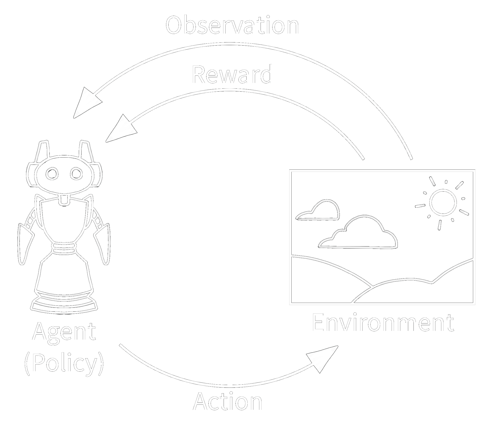
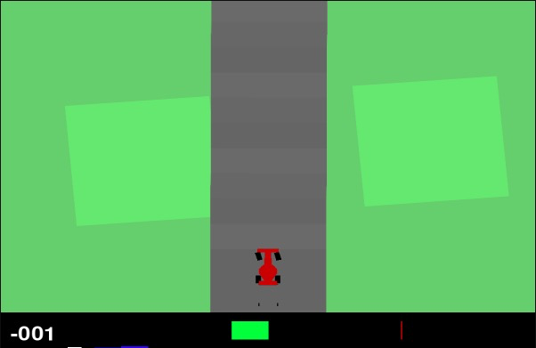
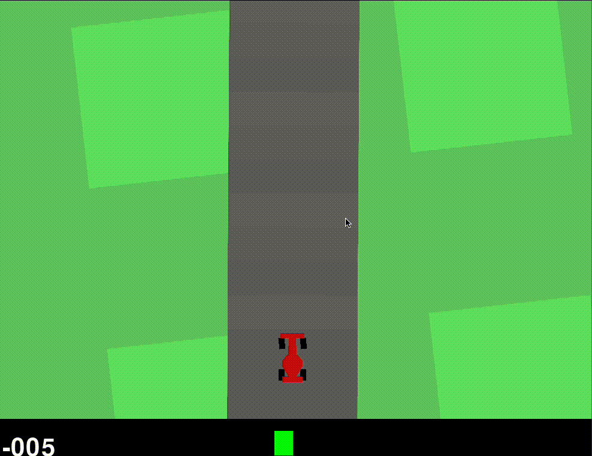

# Self Driving Car with RL

Firstly, I would like thank Professor Raghavendra Singh and my TA, Karan Kumar, to build a somewhat unconventional project for my Introduction to Machine Learning course. This project aimed to build a self driving car of sorts using reinforcement learning algorithms.

## 📜 Context

I have 0 experience with Reinforcement Learning. This project is sort of a medium for me to tinker and figure out how things work. My approach (as shared in the Project Proposal) is to document everything I learn and figure out. This document is part of that devlog/readme with my observations and understanding.

As mentioned in the proposal, I first heard about Reinforcement Learning from a youtube video about [AI playing Pokemon](<[https://www.youtube.com/watch?v=DcYLT37ImBY&t=1403s](https://www.youtube.com/watch?v=DcYLT37ImBY&t=1403s)>). This fascinated me and I proposed a similar alternative, ie, building Mario using RL algorithms. Unfortunately, that proposal was later rejected and now I am going to build out something largely similar but _easier_ — Self Driving Car

## 🎮 Gameplan

My idea is to do this using a Python GUI library like PyGame. From what little understanding I do have, RL seems like gui code being run multiple times by a headless/automated program. I presume this can be done with some ease. I have also thought about potentially using a 3rd party library instead which has a race track simulator of sorts.

My approach to code is as follows:

1. Figure out what is RL
2. Find relevant libraries for RL
3. Use results from 2^ and apply to solve problem statement
4. Have a car which can drive itself.

While the scale of this project is very miniscule in comparison to real world self driving and also a lot less input parameters such as weather, traffic etc. It will be interesting to see how autonomous activity actually works.

### 🚧 Devlog 2 + 3

I spent some time watching YouTube and reading medium articles about what is RL and how it works. With this new depth/context I have gained, the project seems a bit more approachable and possible. It is also a bit concerning to me that Prof and TAs will not be a fan of my unconventional project because I presume my understanding of RL to be very surface level and not properly understanding a lot of the algorithms and math behind it. But I did interact a lot with the science behind it all. Here’s my take on it:

### 🧠 Understanding Reinforcement Learning

Reinforcement learning is **a machine learning training method based on rewarding desired behaviours and punishing undesired ones.** Essentially, RL has **Agents.** These agents work based on rewards. If it does something and gets a reward — great! Do that again! If it doesn’t get a reward, move on and try something else.

It is a form of learning for ML Models, by actively engaging with the **Environment.**

There are 4 key components in RL:

1. Agent: Operator in the environment, governed by programmer’s policy
2. Environment: World/Context/Program the agent can interact in
3. Action: Any task/operation which an agent performs is an action
4. Rewards and Observations: After completing an action, agents receive a reward and snippet of the environment after they are done interacting.



RL is used a lot in gaming because games are an open world environment where players can interact with infinite items in the world and can get/set rewards for any sort of behaviour.

### Types of RL Algorithms

There a LOT of reinforcement learning algorithms grouped into 2 main subgroups — Model Free and Model Based. The major difference between the two is in terms of learning is how they make predictions.

Model Free predicts based on current values of the environment while Model Based predicts based on the future state of the environment and is more premptive.

For the purposes and scale of our problem, Model Free is adequate with algorithms like A2C/A3C(Advantage Actor Critic), PPO (Proximal Policy Optimization).

### 🚧 Devlog 4



Now, to implement this logic I found a few libraries which specifically implement Reinforcement Learning algorithms. Apparently, the algorithms deep down using Neural Networks and as expected the scope of this project is out of my reach 😅
As a solution it is best to use the following libraries:

1. Gymnasium (Public Fork of Gym by OpenAI) for setting the environment for a racing car
2. Stable Baselines for PPO algorithms and vectorising the environment for training testing and validation

Running these simulations on my laptop, takes way longer than i expected it to. GPU consumption is not a problem I had considered.

### 🚧 Devlog 5

Basic setup installation requires the following :

```bash
pip install gymnasium[box2d] # for car sim
pip installl stable-baselines3[extra] # for algorithms

# gui pre-reqs
brew install swig
```

## 🎸 Structure of RL Environment

This is a top down racing environment simulator. The generated track is always random. The action space and rewards is setup as follows

### Action Space

when continuous

- 0: steering, -1 is full left, +1 is full right
- 1: gas
- 2: breaking

if space is discrete

- 0: do nothing
- 1: steer left
- 2: steer right
- 3: gas
- 4: brake

### Rewards

-0.1 for every frame and +1000/N for every track tile visited, where N is the total number of tiles visited in the track.

If you finish 644 frames, your reward is 1000 - 0.1\*732 = 935.6 points.

Each episode finishes when all the tiles are visited. Car can go far off the track, in which case it will receive -100 reward and die.

## 🔍 Observations at 400 Runs

Program run time is nearly 1min on CPU. Car is technically walking. It only know how to go in a straight line. Dies before turning. Need to increase timesteps to get a better idea



## 🔍 Observations at 4k Runs

Program run time is nearly 2min 14seconds on CPU. Car is not walking anymore. Dies before turning. This may be because it is getting positive weights by staying on the road — but it isn’t actually moving.

It is clear i need to increase by a larger delta to see an actual difference in performance.


## 🔍 Observations at 40k Runs

Program run time is nearly 12min on CPU. Car is certainly running now, nowhere near complete. Car goes in straight line, takes turns easily — fails miserably at continuing. Always ends up taking donuts in the middle of the road. Will try 400K timesteps next


## 🔍 Observations at 400k Runs

Program ran for a whopping 113 minutes on CPU. Will have to change all weights and rewards because the car movement has resulted in diminishing returns 😞
Car is moving along the path and turning properly but not on the track anymore!


